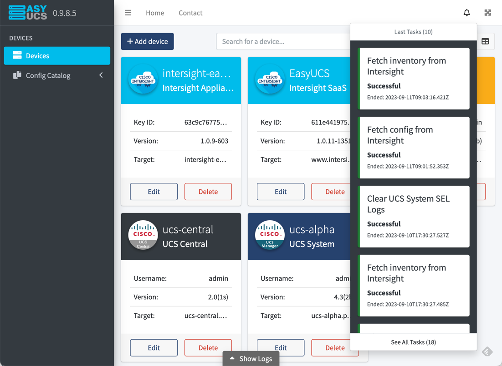

# Working with configuration files

Configuration files can be pushed or fetched to/from a device. They are JSON-formatted files that are meant to be **human-readable** with each section corresponding to a feature.

You can find configuration samples in the **samples** directory. 
This directory contains:
* **best practices** configurations (for BIOS Policies)
* **CVD** configurations for quick deployment of FlashStack/FlexPod/VersaStack
* **sample** configurations grouped by topic. See [below](./CONFIG.md#Samples-for-UCS-System) for more info

[Fetching a live configuration](CONFIG.md#fetch-configurations) from a device is also a good solution to get started.

## Deploy configurations

### Using the Command-Line Interface (CLI)

The file **[easyucs.py](../easyucs.py)** is the main file that you will use. 
You can find help at each step by entering the **"-h"** argument.

The tool first needs the scope of action you want to use as argument:
```
Scope:
  Scope of action

  {config,inventory,schemas,report,device}
                        EasyUCS scope
    config              config-related actions
    inventory           inventory-related actions
    schemas             schemas-related actions
    report              report-related actions
    device              device-related actions
```

The second argument is the type of action:
```
Action:
  {fetch,push}  Config actions
    fetch       Fetch a config from a device
    push        Push a config to a device
```

##### Arguments for a config push 

List of arguments :
  
  - **-h**, --help            | show this help message and exit
  - **-i IP**, --ip IP        | Device IP address
  - **-u USERNAME**, --username USERNAME
                        | Device Account Username
  - **-p PASSWORD**, --password PASSWORD
                        | Device Account Password
  - **-a API_KEY**, --api_key API_KEY
                       | Device Account API Key
  - **-k SECRET_KEY_PATH**, --secret_key_path SECRET_KEY_PATH
                       | Device Account Secret Key (path to file)
  - **-t** {**ucsm**,**cimc**, **ucsc**, **intersight**}, --device_type {ucsm,cimc,ucsc,intersight}
                        | Device type ("ucsm", "cimc", "ucsc" or "intersight")
  - **-v**, --verbose         | Print debug log
  - **-l LOGFILE**, --logfile LOGFILE
                        | Print log in a file
  - **-f FILE**, --file FILE  | UCS Configuration file
  - **-r**, --reset           | Erase Configuration
  - **-s SETUP** [SETUP ...], --setup SETUP [SETUP ...]
                        | Perform Initial setup
  - **-y**, --yes             | Answer yes to all questions


### Using the Web Graphical User Interface (GUI)

The Web GUI is hosted by your machine, in order to launch it you need to use the file **[easyucs_api.py](../easyucs_api.py)**.

```
python easyucs_api.py
```


The result of this command will be something like:

```
2023-09-04 18:15:04,870 :: INFO :: EasyUCS :: manager.py :: in task_scheduler :: Successfully started task scheduler
WARNING: This is a development server. Do not use it in a production deployment. Use a production WSGI server instead.
 * Running on http://localhost:5001
Press CTRL+C to quit
```

It means that the GUI is available on your local machine at the URL http://127.0.0.1:5001/

The GUI can be used to deploy configurations on all types of devices.




## Fetch configurations

*Warning: It is impossible to fetch any kind of password from a live system configuration.*

### Using the Command-Line Interface (CLI)

The file **[easyucs.py](../easyucs.py)** is the main file that you will use. 
You can find help at each step by entering the **"-h"** argument.

It first needs the type of scope of action you want to use as an argument. 
The scope of action:
```
Scope:
  Scope of action

  {config,inventory,schemas,report,device}
                        EasyUCS scope
    config              config-related actions
    inventory           inventory-related actions
    schemas             schemas-related actions
    report              report-related actions
    device              device-related actions
```

The second argument is the type of action:
```
Action:
  {fetch,push}  Config actions
    fetch       Fetch a config from a device
    push        Push a config to a device
```

#### Arguments for a config fetch

List of arguments :

- **-h**, --help            | show this help message and exit
- **-i IP**, --ip IP        | Device IP address
- **-u USERNAME**, --username USERNAME
                      | Device Account Username
- **-p PASSWORD**, --password PASSWORD
                      | Device Account Password
- **-a API_KEY**, --api_key API_KEY
                     | Device Account API Key
- **-k SECRET_KEY_PATH**, --secret_key_path SECRET_KEY_PATH
                     | Device Account Secret Key (path to file)
- **-t** {**ucsm**,**cimc**, **ucsc**, **intersight**}, --device_type {ucsm,cimc,ucsc,intersight}
                      | Device type ("ucsm", "cimc", "ucsc" or "intersight")
- **-v**, --verbose         | Print debug log
- **-l LOGFILE**, --logfile LOGFILE
                    | Print log in a file
- **-o OUTPUT_CONFIG**, --out OUTPUT_CONFIG
                    | Output config file
- **-y**, --yes             | Answer yes to all questions


## Structure of a configuration file

Each JSON file is structured with two sections : "easyucs" and "config"
```json5
{
   "easyucs":{
      
   },
   "config":{
      
   }
}
```
### "easyucs" section

An "easyucs" section is composed of a "metadata" and a potential "options" sections. 

#### Metadata

The main section is "metadata", this section is an array of dict composed of items associated.

The required items are : ***"device_type", "file_type", "easyucs_version"***

The others are : *"category", "device_name", "device_uuid", "device_version", "hash", "name", "origin", "revision", "subcategory", "timestamp", "url", "uuid"*

Some of these other items are not meant to be written by the user. 

Example metadata header:
```json5
{
   "easyucs":{
      "metadata":[
         {
            "file_type": "config",
            "device_type": "ucsm",
            "easyucs_version":"0.9.0",
            "category":"cvd",
            "subcategory":"FlexPod",
            "name":"FlexPod Datacenter with VMware vSphere 6.5, NetApp AFF A-Series and Fibre Channel (6248UP)",
            "url":"https://www.cisco.com/c/en/us/td/docs/unified_computing/ucs/UCS_CVDs/flexpod_esxi65_n9fc.html",
            "revision": "1.0"
         }
      ]
   },
   "config":{
   }
}
```

#### Options

The optional section of the "easyucs" section is "options". This section lets you set some specific options or actions on the device.

The possible items are : *"discover_server_ports_in_order", "erase_all_virtual_drives_before_reset", "erase_all_flexflash_before_reset", "clear_all_sel_logs_before_reset", "set_drives_to_status"*

Example options section:
```json5
{
   "easyucs":{
      "metadata":[
         {
            "file_type": "config",
            "device_type": "cimc",
            "easyucs_version":"0.9.0",
            "category":"custom",
            "subcategory":"samples"
         }
      ],
      "options":[
         {
            "erase_all_flexflash_before_reset": "yes",
            "clear_all_sel_logs_before_reset": "yes",
            "set_drives_to_status": "jbod"
         }
      ]
   },
   "config":{
   }
}
```

### "config" section

This section is composed of all the features of a Device configuration.

Each configuration feature is formatted the same way: a list of dictionaries featuring all the items constituent of this feature.

Example config section:
```json5
{
   "easyucs":{
      "metadata":[...]
   },
   "config":{
      "system":[
         {
            "name":"bb04-6248",
            "virtual_ip":"192.168.156.12",
            "virtual_ipv6":"::",
            "domain_name":"vikings.cisco.com",
            "owner":"",
            "site":"",
            "descr":""
         }
      ],
      "switching_mode":[
         {
            "ethernet_mode":"end-host",
            "fc_mode":"end-host"
         }
      ]
   }
}
```

Some features are placed under an org to respect the hierarchy of the features (in UCS Manager/UCS Central or Intersight). 

Note: In UCS Manager/Central, an org can be placed under an org and so on. The first org must be named "root".

Example orgs section:
```json5
{
   "easyucs":{
      "metadata":[...]
   },
   "config":{
      "system":[
         {
            "name":"bb04-6248",
            "virtual_ip":"192.168.156.12",
            "virtual_ipv6":"::",
            "domain_name":"vikings.cisco.com",
            "owner":"",
            "site":"",
            "descr":""
         }
      ],
      "orgs":[
         {
            "name":"root",
            "ip_pools":[
               {
                  "name":"ext-mgmt",
                  "order":"sequential",
                  "ip_blocks":[
                     {
                        "from":"192.168.156.101",
                        "to":"192.168.156.112",
                        "gateway":"192.168.156.1",
                        "primary_dns":"0.0.0.0",
                        "secondary_dns":"0.0.0.0",
                        "netmask":"255.255.255.0"
                     }
                  ]
               }
            ]
         }
      ]
   }
}
```

For an IMC Device, all the features are on the same level.

You can find the list of all the features and where to find them on the sample config files below. 
To find the list of all the required items and all possible values for each feature, please refer to the JSON Schema files
(not available for UCS IMC yet).

## Samples for UCS System

### Features outside an organization

**config-ucsm-policies.json**

- appliance_network_control_policies

- link_profiles

- udld_link_policies

**config-ucsm-interfaces.json**

- appliance_port_channels

- appliance_ports

- breakout_ports

- fcoe_port_channels

- fcoe_storage_ports

- fcoe_uplink_ports

- lan_pin_groups

- lan_port_channels

- lan_uplink_ports

- qos_system_class

- san_pin_groups

- san_port_channels

- san_storage_ports

- san_unified_ports

- san_uplink_ports

- server_ports

- unified_storage_ports

- unified_uplink_ports

**config-ucsm-vlan-vsan.json**

- appliance_vlans

- storage_vsans

- vlan_groups

- vlans

- vsans

**config-ucsm-admin.json**

- backup_export_policy

- call_home

- dns

- global_policies

- ldap

- local_users

- local_users_properties

- locales

- management_interfaces

- orgs

- pre_login_banner

- radius

- roles

- sel_policy

- system

- tacacs

- timezone_mgmt

- ucs_central

- communication_services

- port_auto_discovery_policy

- slow_drain_timers

- switching_mode

### Features inside an organization

**config-ucsm-org-pools.json**

- orgs

- ip_pools

- uuid_pools

- wwnn_pools

- wwpn_pools

- wwxn_pools

- iqn_pools

**config-ucsm-org-srv-pools.json**

- server_pools

- server_pool_policies

- server_pool_policy_qualifications

**config-ucsm-interfaces.json**

- vnic_templates

- vhba_templates

- default_vnic_behavior

- default_vhba_behavior

**config-ucsm-policies.json**

- power_control_policies

- qos_policies

- power_sync_policies

- ipmi_access_profiles

- kvm_management_policies

- serial_over_lan_policies

- spdm_certificate_policies

- vnic_vhba_placement_policies

- network_control_policies

- flow_control_policies

- lacp_policies

- iscsi_authentication_profiles

- vmedia_policies

- multicast_policies

- link_protocol_policy

- ethernet_adapter_policies

- fibre_channel_adapter_policies

- iscsi_adapter_policies

- memory_policy

- graphics_card_policies

- threshold_policies

- diagnostics_policies

- sas_expander_configuration_policies

**config-ucsm-serviceprofile.json**

- maintenance_policies

- local_disk_config_policies

- host_firmware_packages

- scrub_policies

- boot_policies

- bios_policies

- lan_connectivity_policies

- san_conn_policy

- storage_connection_policies

- fc_zone_profiles

- service_profiles

**config-ucsm-storage.json**

- disk_group_policies

- storage_profiles

**config-ucsm-chassis.json**

- chassis_maintenance_policies

- compute_connection_policies

- chassis_firmware_packages

- disk_zoning_policies

- chassis_profile

## Samples for UCS Central

### Features inside a domain group

**config-ucsc-domain_group-vlan-vsan.json**

- domain_groups

- vlans

- appliance_vlans

- vlan_groups

### Features inside an organization

**config-ucsc-org-pools.json**

- orgs

- ip_pools

- uuid_pools

- wwnn_pools

- wwpn_pools

## Samples for UCS IMC

Coming Soon

## Samples for Intersight

Coming Soon